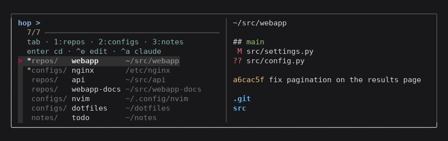
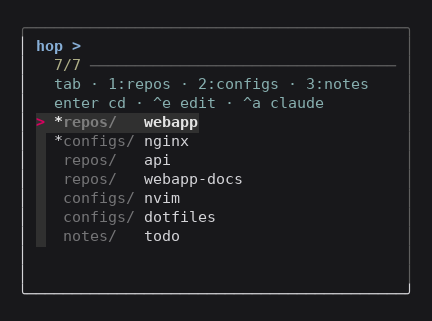

# hop

Bookmarks for the directories you work in. `tab` walks the categories, arrows
pick, `enter` lands you there. Type to filter if you would rather.



`enter` puts your shell in that directory. Other keys act on it in place: open
in `$EDITOR`, pull, push, start an agent.

Bash and `fzf`. No runtime, no build. Works over SSH.

## Narrow terminals

The layout adapts. Below 90 columns the preview hides (`^o` brings it back);
below 46 the path column goes. Switching category is one key rather than a
typed query, which is what makes it usable on a phone or in a thin split.



## Install

```bash
git clone https://github.com/yatahaze/hop.git ~/hop && ~/hop/install.sh
```

Open a new shell, run `hop`.

`install.sh` also adds a shell function, which is required. A program cannot
change its parent shell's directory, so `hop` on `PATH` alone would print a
path and leave you where you were.

## Docs

| | |
|---|---|
| [Install](docs/install.md) | manual install, why the shell function, uninstall |
| [Bookmarks](docs/bookmarks.md) | format, where lists live, how they merge |
| [Roadmap](ROADMAP.md) | Windows, auto-discovery |

MIT, see [LICENSE](LICENSE).
