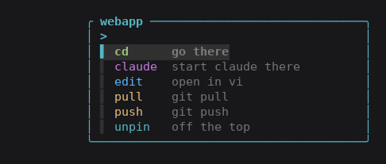

# hop

Bookmarks. Directories and ssh servers. Pick one, choose an option, done.


`enter` on a row:



`enter` again and you are there.

## Install

```bash
git clone https://github.com/yatahaze/hop.git ~/hop && ~/hop/install.sh
```

Open a new shell. Run `hop`.

Windows, from PowerShell 7:

```powershell
git clone https://github.com/yatahaze/hop.git $HOME\hop; & $HOME\hop\install.ps1
```

Open a new PowerShell. Run `hop`.

## More

| | |
|---|---|
| [Install](docs/install.md) | by hand, the shell function, Windows, uninstall |
| [Bookmarks](docs/bookmarks.md) | the file, settings, keys, the menu |
| [SSH hosts](docs/ssh.md) | hosts from your ssh config |
| [Layout](docs/layout.md) | the column, narrow terminals, phones |
| [Roadmap](ROADMAP.md) | what is next |

MIT, see [LICENSE](LICENSE).
